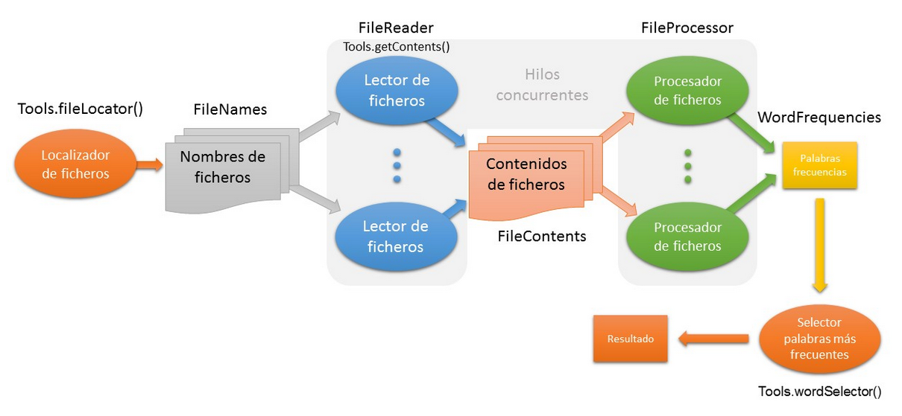

# textprocessing
* Asignatura: Programación IV
* Práctica 3 - Programación Concurrente
* Facultad: Escuela de Ingeniería Informática (ULPGC)

## Procesamiento de ficheros de texto

El funcionamiento del programa es: dado un conjunto de ficheros, los procesa y obtiene una lista de las 10 palabras más frecuentes, ordenadas de mayor a menor. 

### Estructura general

Los ficheros a procesar, que contienen texto sin formato, se encuentran en el directorio **datos** del *HOME* del usuario actual.

El sistema realiza las siguientes acciones:

- Identifica el conjunto de ficheros a procesar —ya implementado en **`Tools.fileLocator()`**— y almacena sus nombres en un objeto de la clase **`FileNames`**.
- Varios hilos de la clase **`FileReader`** van tomando uno a uno los nombres de fichero de un objeto **`FileNames`** y se van encargando de leer los correspondientes ficheros y añadir su contenido a un objeto de la clase **`FileContents`**.
- Varios hilos de la clase **`FileProcessor`** van leyendo uno a uno el contenido de los ficheros de un objeto **`FileContents`** y lo procesan, separando las palabras y contabilizando su frecuencia,  actualizando el resultado sobre un "contador" común de la clase **`WordFrequencies`**.
- Se ordenan y seleccionan las 10 palabras más frecuentes partiendo de un objeto **`WordFrequencies`** —ya implementado en **`Tools.wordSelector()`**.

Para construir el sistema se crean distintas clases que  representen los distintos procesos y contenedores de datos que maneja el sistema.

